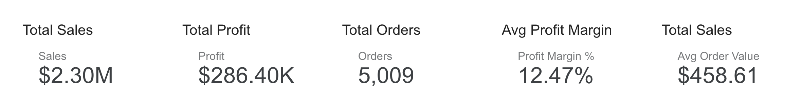
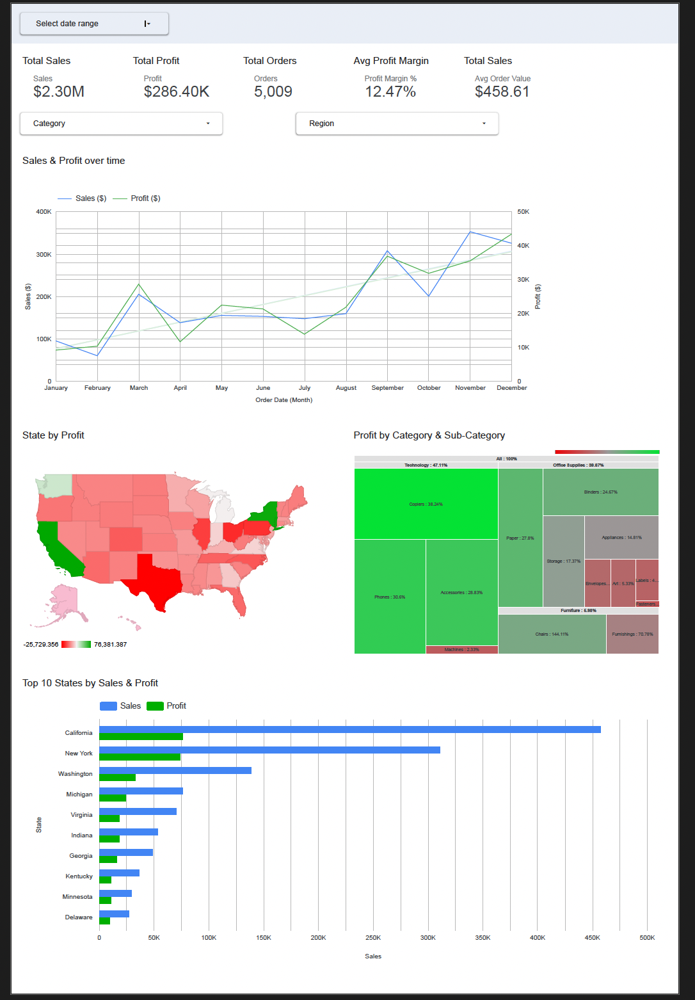

# Retail Analytics Dashboard — Superstore

**Stack:** Python (Colab) → Google Sheets → Looker Studio → GitHub  
**KPIs:** Sales, Profit, Orders, Profit Margin %, Average Order Value

[Live Looker Studio](https://lookerstudio.google.com/reporting/d427dfd0-3c57-4923-83aa-5d492ac107c2) 

---

## Dashboard

**KPI Row**  

**Full Dashboard**  

---

## Key Insights

- **Where it wins:** California and New York lead sales; Technology drives profit.
- **Where it leaks:** Furniture drags margins (notably **Chairs** and **Furnishings**).
- **Map signal:** Several high-volume states show weak or negative profit; focus on price/discount policy and freight.
- **Unit economics:** Margin ≈ **12.5%**, AOV ≈ **$459**. Push higher-margin sub-categories and trim loss-makers.

---

## How to Reproduce

1. **Data**  
   - Use `data/Superstore.xlsx` (included).

2. **Clean + Publish to Sheets**  
   - Open [`notebooks/SuperStore.ipynb`](notebooks/SuperStore.ipynb) in Colab.  
   - Set `SPREADSHEET_URL` to your Google Sheet.  
   - Run all cells → writes:  
     - `Superstore - Prep`  
     - `Superstore - KPI_Summary`

3. **Connect Looker Studio**  
   - Add Google Sheets as data source → select tabs above.  
   - Set field types:  
     - `Order Date` → **Date**  
     - `Sales`, `Profit` → **Currency**  
     - `State` → **Geo → Country subdivision (1st level)**

4. **Build the dashboard**  
   - Replicate: KPI row, dual-axis **Sales & Profit Over Time**, **Profit by State** (drill to City), **Profit by Category → Sub-Category** treemap, **Top 10 States by Sales & Profit** bar.

5. **Validate figures**  
   - Totals should be close to: Sales ≈ **$2.30M**, Profit ≈ **$286K**, Orders ≈ **5,009**, Margin ≈ **12.5%**, AOV ≈ **$459**.

---

## Repo Structure

